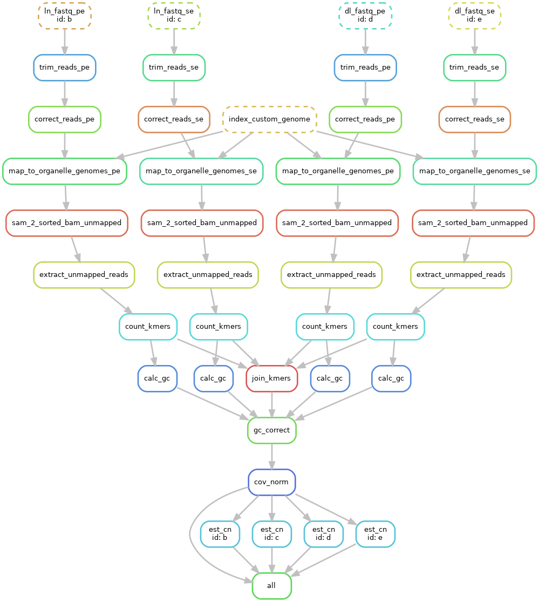

# Kmer-it: A Snakemake Workflow to Generate K-mer Profiles from High-Throughput Sequencing Reads
Kmer-it is a flexible Snakemake workflow to generate genome content profiles from K-mer abundances in high-throughput sequencing reads.

The workflow takes as input high-throughput sequencing reads and produces normalized K-mer frequencies and (optionally) K-mer based copy number estimates for given sequences. 
Several steps of the workflow can be optionally turned off by editing the config file (see below). The software environment required for workflow execution can be installed using conda/mamba.

## Workflow description
1. ###Data import###  
The workflow can handle both paired-end or single-end high throughput sequencing reads provided as either a raw or gzipped [FASTQ file](https://en.wikipedia.org/wiki/FASTQ_format). 
The files can be available locally by providing the path (see sample file) or remotely by providing a FTP link for download. It is assumed that each sample is represented by a single
sequencing run.

2. ##Trimming##
Trimmomatic is used to trim Illumina adapters and low quality sequences. The trimmomatic options can be modified in the config file. This step is optional. 

3. ##Read error correction##
Putative read errors are corrected using BayesHammer tool packaged in SPAdes. This step is optional.

4. ##Filter organellar reads##
Reads mapping to organellar genomes are filtered by mapping the processed reads to organellar genomes with bwa mem and extracting unmapped reads for subsequent steps. 
A custom organellar genome file can be specified or alternatively the workflow will download a local copy of the [NCBI Organelle Genome Database](https://www.ncbi.nlm.nih.gov/genome/organelle/), which can take a very long time, to use for mapping. This step is optional.  

5. ##K-mer counting##
Canonical K-mers (i.e. a K-mer and its reverse complement are considered to be the same) are then counted in the processed reads. The value for K is specified in the config file. 
The pipeline has been tested only for small K e.g., K < 13 and we don't have good advice as to which value should be chosen for this parameter.

6. ##K-mer count GC normalization##
Raw K-mer counts are then GC normalized across samples. To this end, a binning approach is used where the proportion of K-mer counts per GC bin (defined by the K-mer) is calculated for each sample.
A "reference" bin is then calculated by taking the median proportion of K-mer counts per bin across all samples. 
Normalization weights are then calculated as the ratio of K-mer count proportion per sample to the reference value for each GC bin and then the weights are applied to adjust the K-mer counts.
This step is optional.

7. ##K-mer count coverage normalization##
To normalize K-mer counts for coverage, counts are quantile-quantile normalized using limma voom. This step is optional. 

8. ##K-mer based copy number estimates## 
K-mer based copy number estimates can then be calculated for a given set of sequences. 
The estimate is generated by taking the median normalized K-mer count for constitutive overlapping K-mers of a sequence.

Here's a full schematic of the workflow executed on 4 samples:
  

## Installation
1. Clone this repository:
`git clone https://github.com/cjfiscus/Kmer-it.git`

2. Move into cloned repo
`cd Kmer-it`

3. [If needed, install conda/mamba](https://mamba.readthedocs.io/en/latest/installation/mamba-installation.html#)

4. Install dependencies with mamba:
`mamba env create -n kmerit -f workflow/envs/environment.yaml`

5. Activate environment:
`mamba activate kmerit`

## Running the workflow
1. Edit the sample file found at config/samples.tsv 
Here's a sample file showing an example of both paired and single end reads available locally (file paths) or remotely (ftp links):
`id	sample_name	fq1	fq2
b	test_paired	resources/SRR1945436_1.fastq.gz	resources/SRR1945436_2.fastq.gz
c	test_single	resources/SRR1945434.fastq.gz
d	test_paired2	https://cluster.hpcc.ucr.edu/\~cfisc004/A_thal_repeats/SRR1945437_1.fastq.gz	https://cluster.hpcc.ucr.edu/\~cfisc004/A_thal_repeats/SRR1945437_2.fastq.gz
e	test_single2	https://cluster.hpcc.ucr.edu/~cfisc004/A_thal_repeats/SRR1945436.fastq.gz
`

2. Edit the config file found at config/config.yaml. Specify which steps you want to run by enabling them. Here's the default config file running all steps of the workflow:
`# Kmer-it config

## sample file
sample_file: "config/samples.tsv"

## trimming options
trimming:
    enable: true # true | false
    trimmomatic_pe: "ILLUMINACLIP:resources/PE_all.fa:2:30:10 LEADING:5 TRAILING:5 SLIDINGWINDOW:4:20 MINLEN:36"
    trimmomatic_se: "ILLUMINACLIP:resources/SE_all.fa:2:30:10 LEADING:5 TRAILING:5 SLIDINGWINDOW:4:20 MINLEN:36"

## error correction options
error_correct:
    enable: true # true | false

## mapping options
map_to_organellar_genomes:
    enable: true # true | false
    use_custom_org_genome: true # true | false
    custom_org_genome_path: "resources/pt_genome.fa"

## K-mer to use
k: 6

## count normalization options
normalization:
    gc_correct: true # true | false
    cov_norm: true # true | false

## enable cnv ests from kmers
estimate_cnv:
    enable: true # true | false
    seq_lib: "resources/seqs.fa"
`

3. Execute the workflow specifying the compute resources to use e.g.,
`snakemake --cores 2`  

## Citation
If you use this software, please cite:
